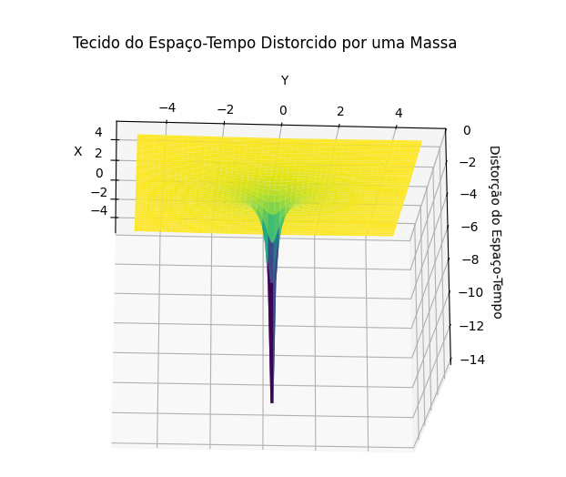
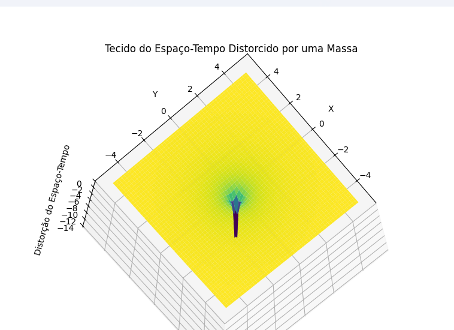

# 🌌 Simulação 3D: Deformidade do Espaço-Tempo

<div align="center">
    
</div>

## 🧑‍🔬 Sobre o Projeto
	@@ -10,7 +10,7 @@ Este projeto é uma **simulação visual em 3D da deformidade do espaço-tempo**
🔍 **Objetivos do Projeto**:
- Tornar conceitos avançados de física acessíveis por meio de simulações interativas.
- Mostrar de forma visual como massas deformam o espaço-tempo ao seu redor.
- Criar um recurso educacional para professores, estudantes e entusiastas de ciência.

---

	@@ -26,11 +26,11 @@ Este projeto é uma **simulação visual em 3D da deformidade do espaço-tempo**

## 🎥 Demonstração
<div align="center">
    
    <p><i>Visualização da deformidade gerada por uma massa no espaço-tempo.</i></p>
</div>

> **Nota**: Para assistir à simulação em ação, veja o [vídeo completo aqui](ninjaflex.com).
---

## 💡 Funcionalidades
✔️ Simulação 3D precisa e interativa.  
✔️ Visualização de conceitos teóricos, como *curvatura gravitacional*.  
✔️ Modelo escalável para fenômenos mais complexos (*ex.: buracos negros, ondas gravitacionais*).  
---
## 🛠️ Como Executar o Projeto
1. Clone este repositório:
   ```bash
   git clone https://github.com/seu-usuario/simulacao-espaco-tempo.git